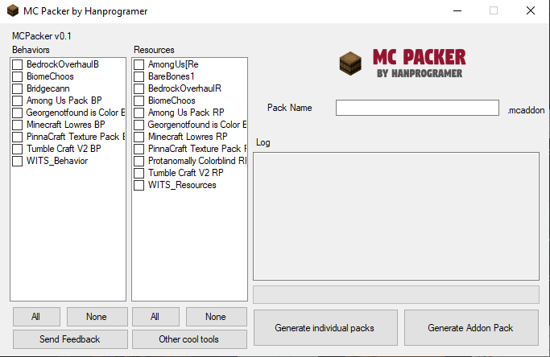

# MCPacker
Mc Packer is a program used to make .mcaddon file which user can doubble click to install your addon.
It can also merge packs together to a single click installation file (.mcpack)
https://link-to.net/147407/mcpacker

 
<iframe src="https://discordapp.com/widget?id=567694190901985300&amp;theme=dark" style="max-width: 256px;" width="350" height="500" allowtransparency="true" frameborder="0" sandbox="allow-popups allow-popups-to-escape-sandbox allow-same-origin allow-scripts"></iframe>

<a class="downloadBtnReg" href="https://link-to.net/147407/mcpacker" target="_blank">Download via Linkvertise</a>